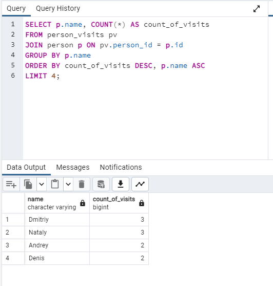
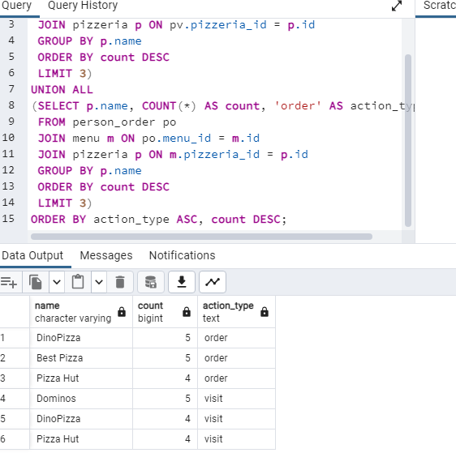
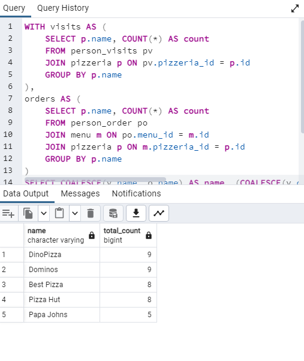
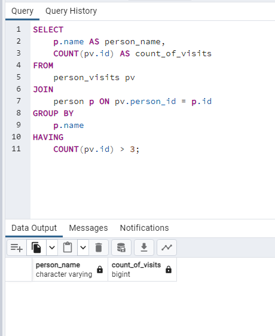
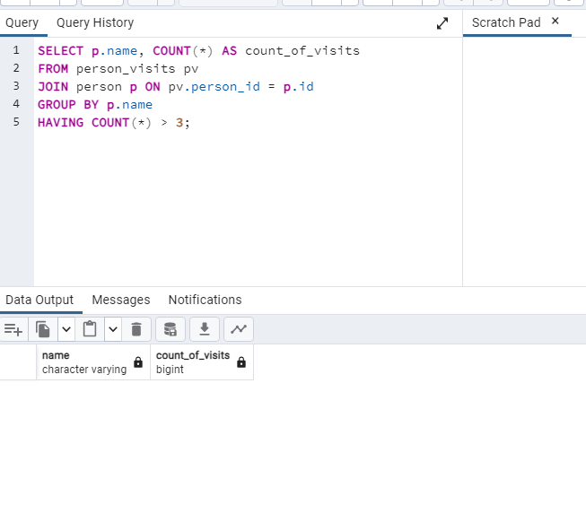
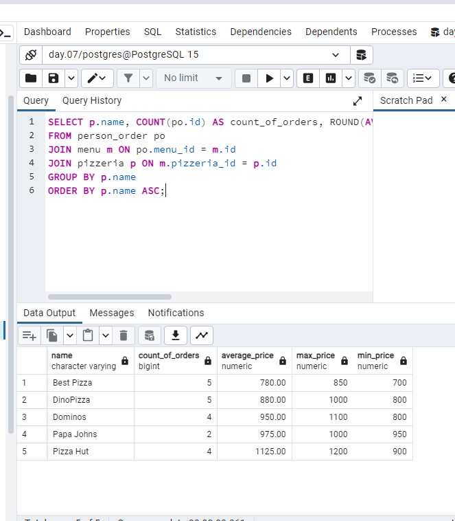
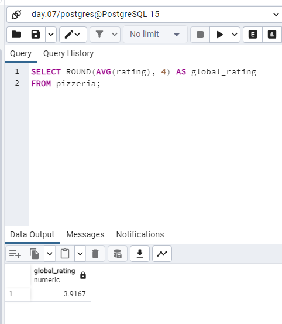
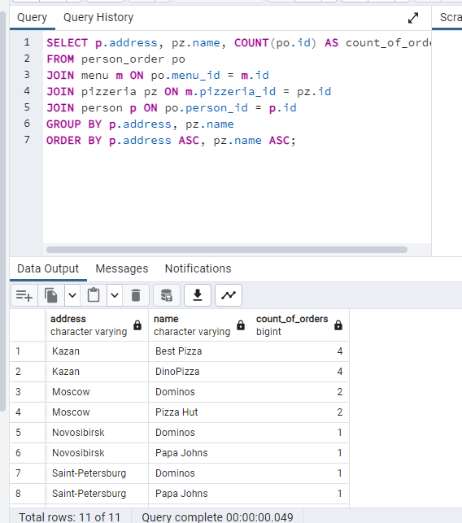
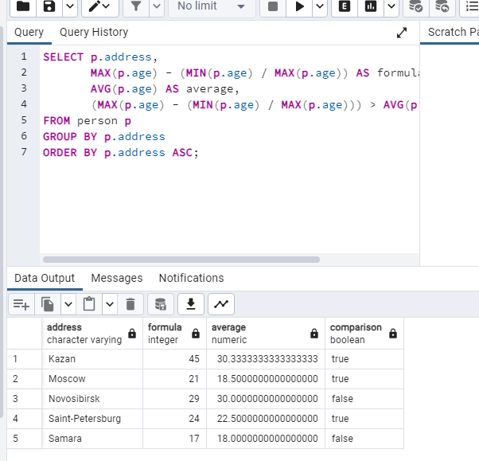

## Exercise 00 - Simple aggregated information

```sql
SELECT person_id, COUNT(*) AS count_of_visits
FROM person_visits
GROUP BY person_id
ORDER BY count_of_visits DESC, person_id ASC
```



## Exercise 01 - Let’s see real names
```sql
SELECT p.name, COUNT(*) AS count_of_visits
FROM person_visits pv
JOIN person p ON pv.person_id = p.id
GROUP BY p.name
ORDER BY count_of_visits DESC, p.name ASC
LIMIT 4;
```


## Exercise 02 - Restaurants statistics

```sql
(SELECT p.name, COUNT(*) AS count, 'visit' AS action_type
 FROM person_visits pv
 JOIN pizzeria p ON pv.pizzeria_id = p.id
 GROUP BY p.name
 ORDER BY count DESC
 LIMIT 3)
UNION ALL
(SELECT p.name, COUNT(*) AS count, 'order' AS action_type
 FROM person_order po
 JOIN menu m ON po.menu_id = m.id
 JOIN pizzeria p ON m.pizzeria_id = p.id
 GROUP BY p.name
 ORDER BY count DESC
 LIMIT 3)
ORDER BY action_type ASC, count DESC;
```


## Exercise 03 - Restaurants statistics #2

```sql
WITH visits AS (
    SELECT p.name, COUNT(*) AS count
    FROM person_visits pv
    JOIN pizzeria p ON pv.pizzeria_id = p.id
    GROUP BY p.name
),
orders AS (
    SELECT p.name, COUNT(*) AS count
    FROM person_order po
    JOIN menu m ON po.menu_id = m.id
    JOIN pizzeria p ON m.pizzeria_id = p.id
    GROUP BY p.name
)
SELECT COALESCE(v.name, o.name) AS name, (COALESCE(v.count, 0) + COALESCE(o.count, 0)) AS total_count
FROM visits v
FULL OUTER JOIN orders o ON v.name = o.name
ORDER BY total_count DESC, name ASC;
```



## Exercise 04 - Clause for groups

```sql
SELECT p.name, COUNT(*) AS count_of_visits
FROM person_visits pv
JOIN person p ON pv.person_id = p.id
GROUP BY p.name
HAVING COUNT(*) > 3;
```



## Exercise 05 - Person's uniqueness
```sql
SELECT p.name, COUNT(po.id) AS count_of_orders, ROUND(AVG(m.price), 2) AS average_price, MAX(m.price) AS max_price, MIN(m.price) AS min_price
FROM person_order po
JOIN menu m ON po.menu_id = m.id
JOIN pizzeria p ON m.pizzeria_id = p.id
GROUP BY p.name
ORDER BY p.name ASC;
```



## Exercise 06 - Restaurant metrics
```sql
SELECT p.name, COUNT(po.id) AS count_of_orders, ROUND(AVG(m.price), 2) AS average_price, MAX(m.price) AS max_price, MIN(m.price) AS min_price
FROM person_order po
JOIN menu m ON po.menu_id = m.id
JOIN pizzeria p ON m.pizzeria_id = p.id
GROUP BY p.name
ORDER BY p.name ASC;
```


## Exercise 07 - Average global rating
```sql
SELECT ROUND(AVG(rating), 4) AS global_rating
FROM pizzeria;
```


## Exercise 08 - Find pizzeria’s restaurant locations

```sql
SELECT p.address, pz.name, COUNT(po.id) AS count_of_orders
FROM person_order po
JOIN menu m ON po.menu_id = m.id
JOIN pizzeria pz ON m.pizzeria_id = pz.id
JOIN person p ON po.person_id = p.id
GROUP BY p.address, pz.name
ORDER BY p.address ASC, pz.name ASC;
```



## Exercise 09 - Explicit type transformation

```sql
SELECT p.address,
       MAX(p.age) - (MIN(p.age) / MAX(p.age)) AS formula,
       AVG(p.age) AS average,
       (MAX(p.age) - (MIN(p.age) / MAX(p.age))) > AVG(p.age) AS comparison
FROM person p
GROUP BY p.address
ORDER BY p.address ASC;
```
